# 刷题

## pattern

### sliding window

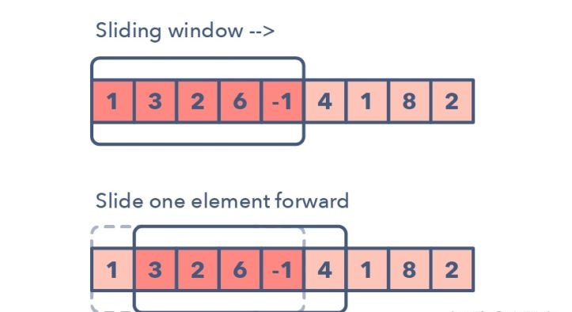

- [x] Maximum Sum Subarray of Size K (easy)
- [x] Smallest Subarray with a given sum (easy)
- [x] Longest Substring with K Distinct Characters (medium)
- [x] Fruits into Baskets (medium)
- [x] No-repeat Substring (hard)
- [x] Longest Substring with Same Letters after Replacement (hard)
- [x] Longest Subarray with Ones after Replacement (hard)

### two pointers

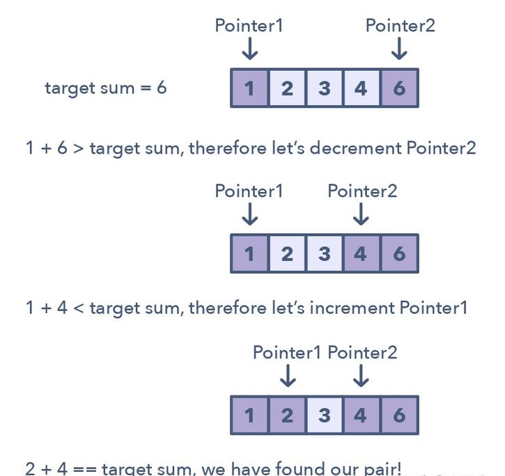

- [x] Remove Duplicates (easy)
- [x] Squaring a Sorted Array (easy)
- [x] Triplet Sum to Zero (medium)
- [x] Triplet Sum Close to Target (medium)
- [x] Triplets with Smaller Sum (medium)
- [x] Subarrays with Product Less than a Target (medium)
- [x] Dutch National Flag Problem (medium) ,aka sort color

### fast & slow pointers

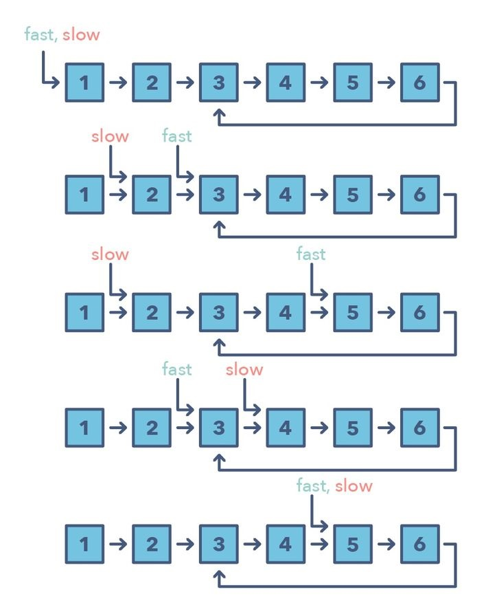

- [x] LinkedList Cycle (easy)
- [x] Start of LinkedList Cycle (medium)
- [x] Happy Number (medium)
- [x] Middle of the LinkedList (easy)

### merge intervals

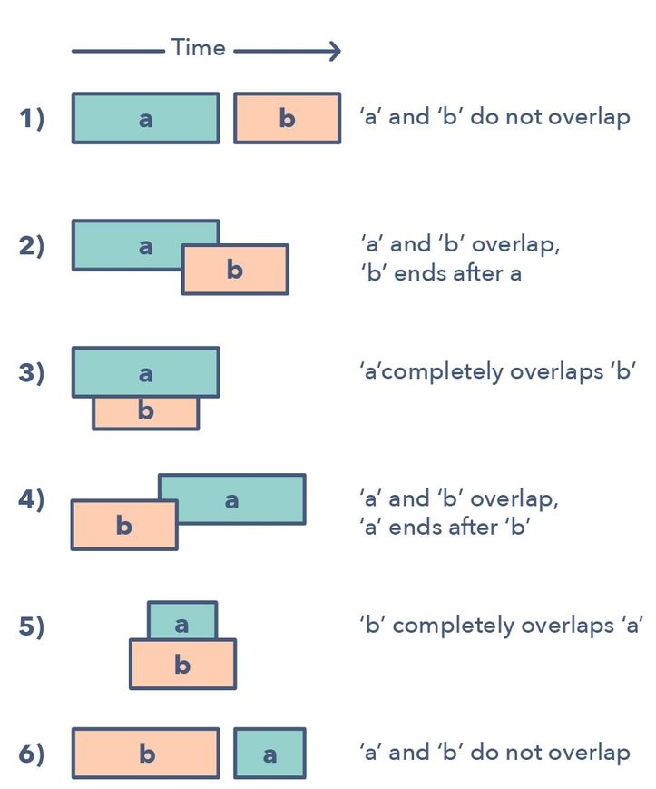

- [x] Merge Intervals (medium)
- [] Insert Interval (medium)
- [] Intervals Intersection (medium)
- [] Conflicting Appointments (medium)

### cyclic sort

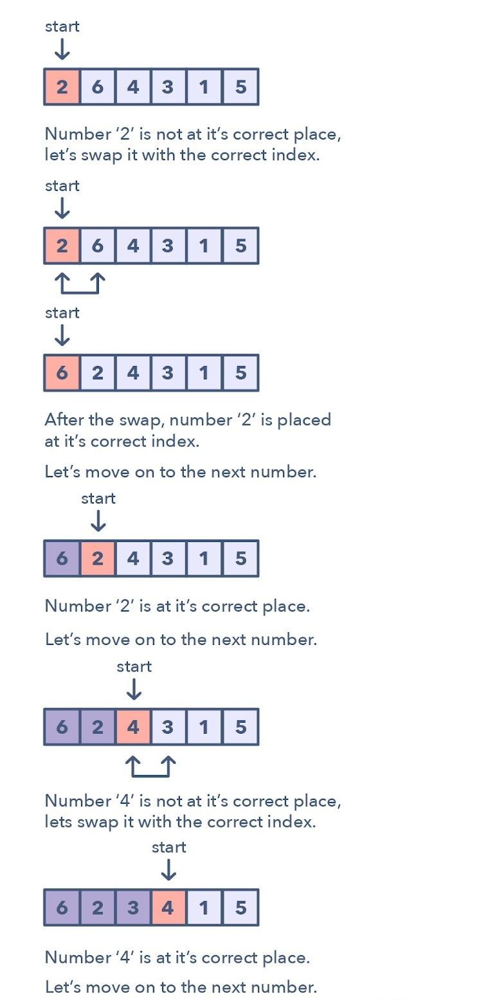

- [] Cyclic Sort (easy)
- [] Find the Missing Number (easy)
- [] Find all Missing Numbers (easy)
- [] Find the Duplicate Number (easy)
- [] Find all Duplicate Numbers (easy)

### in-place reversal of a linkedlist

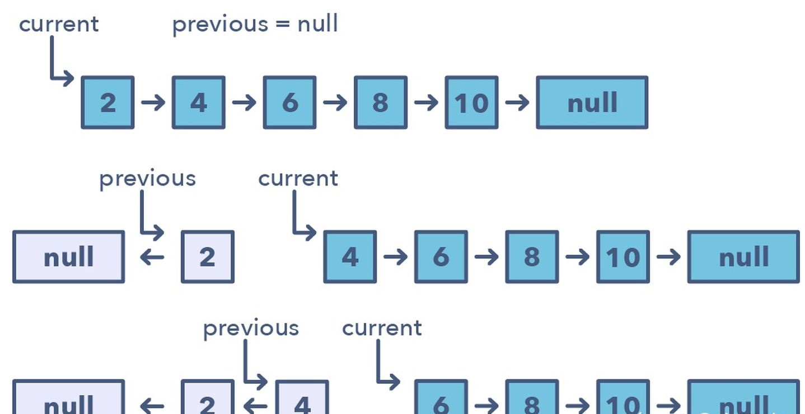

- [] Reverse a LinkedList (easy)
- [] Reverse a Sub-list (medium)
- [] Reverse every K-element Sub-list (medium)

### Tree Breadth First Search

层序遍历

- [] Binary Tree Level Order Traversal (easy)
- [] Reverse Level Order Traversal (easy)
- [] Zigzag Traversal (medium)
- [] Level Averages in a Binary Tree (easy)
- [] Minimum Depth of a Binary Tree (easy)
- [] Level Order Successor (easy)
- [] Connect Level Order Siblings (medium)

### two heaps

- [] Find the Median of a Number Stream (medium)
- [] Sliding Window Median (hard)
- [] Maximize Capital (hard)

### subsets

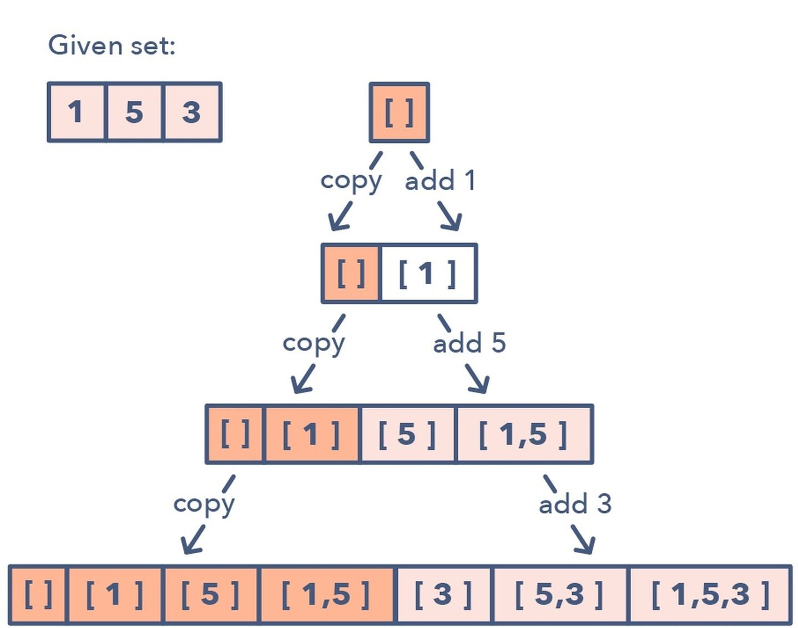

- [] Subsets (easy)
- [] Subsets With Duplicates (easy)
- [] Permutations (medium)
- [] String Permutations by changing case (medium)
- [] Balanced Parentheses (hard)
- [] Unique Generalized Abbreviations (hard)

### modified binary search

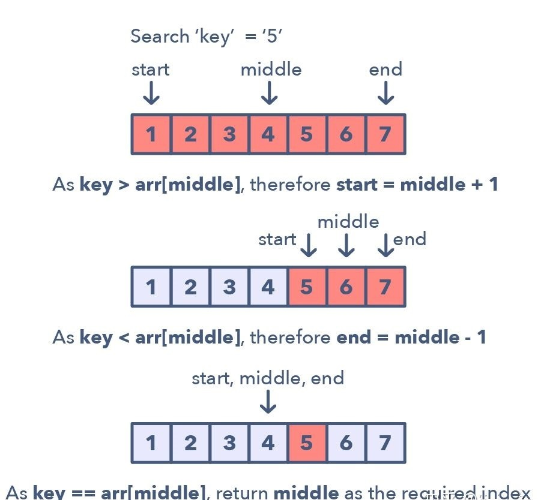

- [] Order-agnostic Binary Search (easy)
- [] Ceiling of a Number (medium)
- [] Next Letter (medium)
- [] Number Range (medium)
- [] Search in a Sorted Infinite Array (medium)
- [] Minimum Difference Element (medium)
- [] Bitonic Array Maximum (easy)

### top k

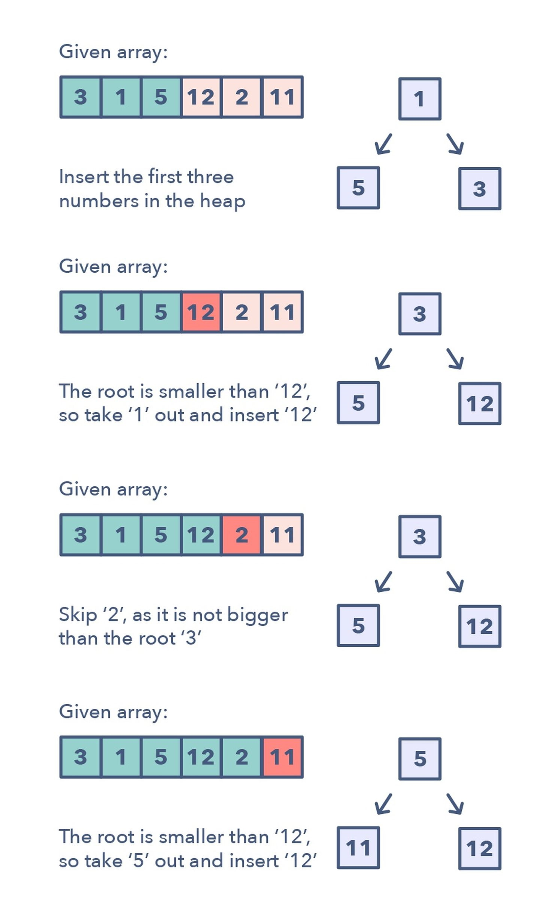

- [] Top K Numbers (easy)
- [] Kth Smallest Number (easy)
- [] K Closest Points to the Origin (easy)
- [] Connect Ropes (easy)
- [] Top K Frequent Numbers (medium)
- [] Frequency Sort (medium)
- [] Kth Largest Number in a Stream (medium)
- [] K Closest Numbers (medium)
- [] Maximum Distinct Elements (medium)
- [] Sum of Elements (medium)
- [] Rearrange String (hard)

### k-way merge

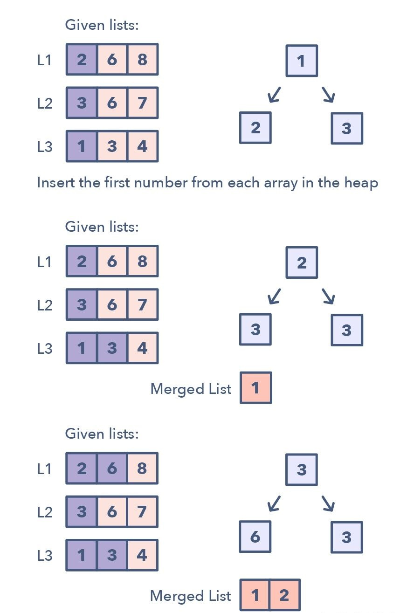

- [] Merge K Sorted Lists (medium)
- [] Kth Smallest Number in M Sorted Lists (Medium)
- [] Kth Smallest Number in a Sorted Matrix (Hard)
- [] Smallest Number Range (Hard)

### 0/1 Knapsack

- [] 0/1 Knapsack (medium)
- [] Equal Subset Sum Partition (medium)
- [] Subset Sum (medium)
- [] Minimum Subset Sum Difference (hard)
- [] Count of Subset Sum
- [] Target Sum

### topological sort

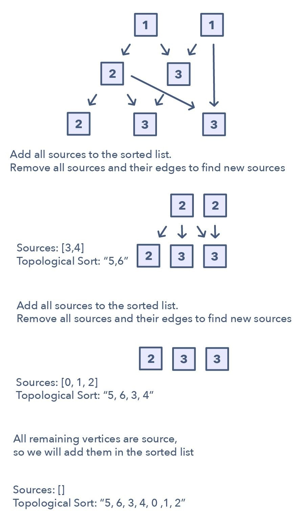

- [] Topological Sort (medium)
- [] Tasks Scheduling (medium)
- [] Tasks Scheduling Order (medium)
- [] All Tasks Scheduling Orders (hard)
- [] Alien Dictionary (hard)

## DP

### Knapsack

- [] 0/1 Knapsack，0/1 背包问题
- [] Equal Subset Sum Partition，相等子集划分问题
- [] Subset Sum，子集和问题
- [] Minimum Subset Sum Difference，子集和的最小差问题
- [] Count of Subset Sum，相等子集和的个数问题
- [] Target Sum，寻找目标和的问题

### Unbounded Knapsack，无限背包

- [] Unbounded Knapsack，无限背包
- [] Rod Cutting，切钢条问题
- [] Coin Change，换硬币问题
- [] Minimum Coin Change，凑齐每个数需要的最少硬币问题
- [] Maximum Ribbon Cut，丝带的最大值切法

### Fibonacci Numbers，斐波那契数列

- [] Fibonacci numbers，斐波那契数列问题
- [] Staircase，爬楼梯问题
- [] Number factors，分解因子问题
- [] Minimum jumps to reach the end，蛙跳最小步数问题
- [] Minimum jumps with fee，蛙跳带有代价的问题
- [] House thief，偷房子问题

### Palindromic Subsequence，回文子系列

- [] Longest Palindromic Subsequence，最长回文子序列
- [] Longest Palindromic Substring，最长回文子字符串
- [] Count of Palindromic Substrings，最长子字符串的个数问题
- [] Minimum Deletions in a String to make it a Palindrome，怎么删掉最少字符构成回文
- [] Palindromic Partitioning，怎么分配字符，形成回文

### Longest Common Substring，最长子字符串系列

- [] Longest Common Substring，最长相同子串
- [] Longest Common Subsequence，最长相同子序列
- [] Minimum Deletions & Insertions to Transform a String into another，字符串变换
- [] Longest Increasing Subsequence，最长上升子序列
- [] Maximum Sum Increasing Subsequence，最长上升子序列和
- [] Shortest Common Super-sequence，最短超级子序列
- [] Minimum Deletions to Make a Sequence Sorted，最少删除变换出子序列
- [] Longest Repeating Subsequence，最长重复子序列
- [] Subsequence Pattern Matching，子序列匹配
- [] Longest Bitonic Subsequence，最长字节子序列
- [] Longest Alternating Subsequence，最长交差变换子序列
- [] Edit Distance，编辑距离
- [] Strings Interleaving，交织字符串
